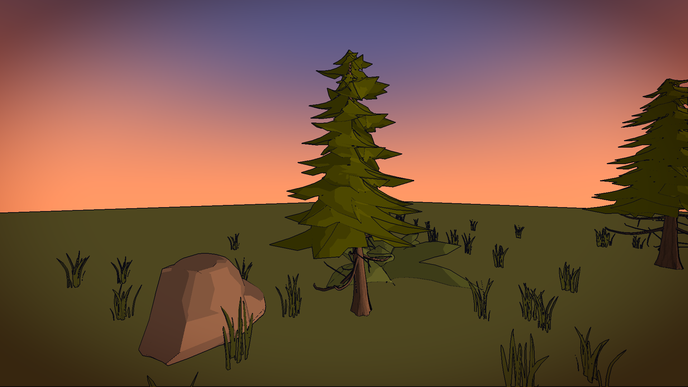
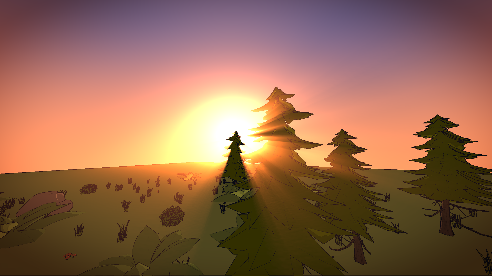
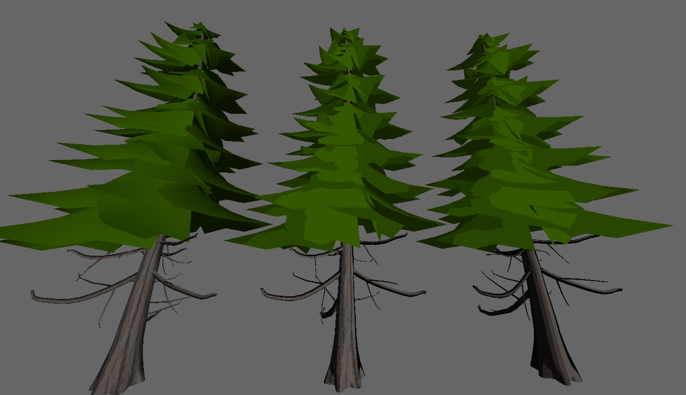

#  — Cel-Shaded Forest Renderer —

A real-time OpenGL 4.1 renderer that draws a low-poly pine forest in a
**cel / toon shading** style: quantized lighting ramps, screen-space ink
outlines, volumetric god rays and a procedural sky, all tunable live from an
ImGui panel.

Written in C++20 with a hand-rolled math and OBJ-loading layer — no GLM, no
Assimp.



---

## Highlights

| | |
|---|---|
| **Cel shading** | `N·L` is fed through a 256×1 lightness ramp texture, quantized to 4 bands — no smooth falloff |
| **Ink outlines** | Screen-space post-pass combining a depth discontinuity filter with a normal discontinuity filter reconstructed from the depth buffer |
| **God rays** | Radial blur from the projected sun position, over bright pixels only (HDR `RGB16F` scene buffer) |
| **Procedural sky** | Horizon→zenith gradient, sun disc with two-lobe glow, and scrolling FBM clouds raymarched onto a plane |
| **Scattered vegetation** | Trees, grass, ferns, bushes, rocks and mushrooms placed by seeded pseudo-random scatter |
| **Live tuning** | ~40 parameters exposed through an ImGui panel — press <kbd>Tab</kbd> mid-flight |

---

## Gallery

**Sun low on the horizon — god rays streaming through the canopy.**
Outlines stay crisp against the bloom because they are applied *before* the
rays are accumulated.



**The source geometry**, before any toon treatment — flat-shaded pine trunk and
leaf meshes. Everything the renderer draws is built from a handful of low-poly
OBJ files like these.



**The lighting ramp.** Instead of shading with `N·L` directly, the fragment
shaders sample a 256-pixel-wide 1D texture indexed by `N·L`. The ramp is
generated at startup with a configurable number of levels — this is the 4-band
version, and the same ramp multiplied by a bark-brown albedo:

| Lightness ramp (4 levels) | × albedo |
|---|---|
|  |  |

Widening or narrowing the bands is a one-line change to the `levels` argument;
the darkest band is clamped by a `min_shade` floor so shadows never go fully
black.

---

## Rendering pipeline

The frame is built in two stages by `Renderer::render`, driven by a list of
`RenderPass` objects:

```
                 ┌─────────────────── offscreen FBO (RGB16F + D24S8) ──┐
  SkyPass      ──┤  gradient + sun disc + FBM clouds                   │
  GroundPass   ──┤  wrapped-diffuse ground plane                       │
  GrassPass ×5  ─┤  grass, bushes, ferns, rocks, mushrooms (ramped)    │
  ForestPass   ──┤  30 pine instances: trunk (textured) + leaves       │
                 └────────────────────────┬────────────────────────────┘
                                          │ color + depth
                                          ▼
  PostPass  ──►  outlines → god rays → warm/cool grade → vignette → gamma
                                          │
                                          ▼
                                      default FBO
```

**Why an offscreen buffer.** The outline pass needs the depth buffer as a
*texture*, and the god-ray pass needs HDR values above 1.0 to decide what
glows. Both require rendering the scene to an FBO first.

**Outline detection** runs two filters and takes the max:

- *Depth edges* — sample linearized depth in a 4-neighbourhood, sum the
  absolute differences, divide by the centre depth so the threshold is
  scale-invariant with distance.
- *Normal edges* — reconstruct view-space normals from the depth buffer using
  the closer of the forward/backward difference on each axis (this avoids
  smearing across silhouettes), then measure `1 - dot(n, n_neighbour)`.

The depth filter alone misses creases on a single surface; the normal filter
alone misses silhouettes against a same-depth background. Together they give
the ink look visible on the trunks and grass blades above.

**God rays** project `sun_dir` into clip space, then march ~100 samples from
each fragment toward the sun's screen position, accumulating only the
over-1.0 component of the scene colour with an exponential decay. Off-screen
suns are handled by the `sclip.w > 0` guard.

---

## Layout

```
src/
  core/      matrix4, vector3, camera, ground geometry
  render/    renderer, render passes, framebuffer, shader programs
  io/        OBJ loader, TGA image I/O, toon-ramp generation
  ui/        ImGui parameter panel
shaders/     sky, ground, toon (trunk/leaves), post-process
assets/      low-poly OBJ meshes + TGA textures
```

`RenderParams` (`src/render/render_params.hh`) is the single struct holding
every tunable; it is filled by the GUI and pushed to shader uniforms once per
frame, so adding a slider means adding one field and one `ImGui::SliderFloat`.

---

## Build & run

**Requirements:** CMake ≥ 3.21, a C++20 compiler, OpenGL 4.1, GLEW, GLUT.
Dear ImGui v1.92.8 is fetched automatically by CMake — no manual setup.

```sh
# Debian / Ubuntu
sudo apt install cmake libglew-dev freeglut3-dev

# macOS
brew install cmake glew freeglut
```

```sh
mkdir build && cd build
cmake ..
make
./main
```

Assets and shaders are copied next to the binary as part of the build, so
`./main` works from the build directory.

### Controls

| Key | Action |
|---|---|
| <kbd>Z</kbd>/<kbd>W</kbd> <kbd>Q</kbd>/<kbd>A</kbd> <kbd>S</kbd> <kbd>D</kbd> | Move (AZERTY and QWERTY both work) |
| Mouse | Look around |
| <kbd>Tab</kbd> | Toggle the parameter panel (releases mouse look) |
| <kbd>Esc</kbd> | Quit |

The rendered shots above were framed and lit entirely from that panel — sun
direction and colour, sky gradient, cloud cover, rim thresholds, ray density
and decay, outline thickness and thresholds, grading and gamma.

---

## Notes & limitations

- No shadow mapping: the ground uses a wrapped-diffuse term
  (`(N·L + wrap) / (1 + wrap)`) rather than casting real shadows.
- Vegetation is drawn one instance at a time rather than with instanced
  rendering; the scene is small enough that it has not been a bottleneck.
- The near/far planes are hardcoded in the post-process shader
  (`NEAR 1.0` / `FAR 250.0`) and must match `init_POV`.
